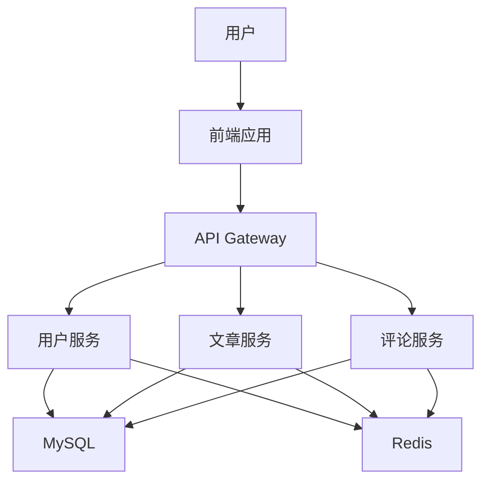
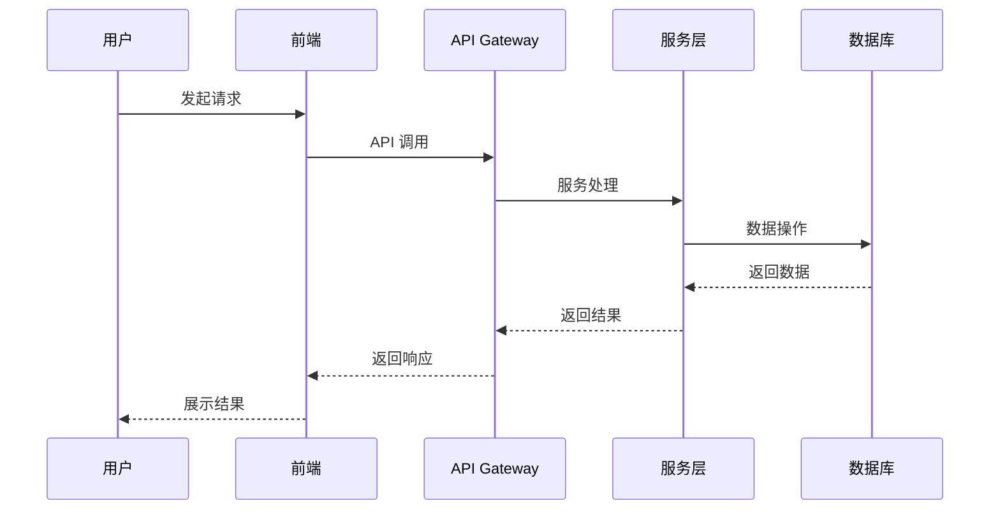

# 博客系统架构文档

Status: Draft

## Technical Summary
本博客系统采用前后端分离架构，前端使用 Next.js 框架，后端使用 Go 语言实现。系统采用微服务架构，主要包含用户服务、文章服务、评论服务等核心模块。使用 MySQL 作为主数据库，Redis 作为缓存层，实现高性能的数据访问。系统采用 JWT 进行身份认证，并实现了完整的权限控制系统。

## Technology Table

| 技术 | 描述 |
|------|------|
| Next.js | 前端框架，提供 SSR 和静态生成能力 |
| React | 前端 UI 库 |
| TypeScript | 类型安全的 JavaScript 超集 |
| Tailwind CSS | 实用优先的 CSS 框架 |
| Go | 后端主要开发语言 |
| Gin | Go Web 框架 |
| GORM | Go ORM 框架 |
| MySQL | 关系型数据库 |
| Redis | 缓存数据库 |
| Docker | 容器化部署 |
| Nginx | Web 服务器和反向代理 |

## Architectural Diagrams

### 系统架构图


### 数据流图


## Data Models

### 用户模型
```go
type User struct {
    ID        uint      `gorm:"primaryKey"`
    Username  string    `gorm:"unique;not null;type:varchar(50)"`
    Email     string    `gorm:"unique;not null;type:varchar(100)"`
    Password  string    `gorm:"not null;type:varchar(100)"`
    Role      string    `gorm:"default:user;type:varchar(20)"`
    CreatedAt time.Time
    UpdatedAt time.Time
}
```

### 文章模型
```go
type Article struct {
    ID        uint      `gorm:"primaryKey"`
    Title     string    `gorm:"not null;type:varchar(200)"`
    Content   string    `gorm:"type:text;not null"`
    AuthorID  uint      `gorm:"not null"`
    Status    string    `gorm:"default:draft;type:varchar(20)"`
    Tags      []Tag     `gorm:"many2many:article_tags"`
    CreatedAt time.Time
    UpdatedAt time.Time
}
```

### 评论模型
```go
type Comment struct {
    ID        uint      `gorm:"primaryKey"`
    Content   string    `gorm:"type:text;not null"`
    ArticleID uint      `gorm:"not null"`
    UserID    uint      `gorm:"not null"`
    ParentID  *uint
    Status    string    `gorm:"default:pending;type:varchar(20)"`
    CreatedAt time.Time
    UpdatedAt time.Time
}
```

## Project Structure

```
├── /frontend
│   ├── /components    # React 组件
│   ├── /app           # Next.js 页面
│   ├── /styles        # 样式文件
│   ├── /utils         # 工具函数
│   └── /types         # TypeScript 类型定义
├── /backend
│   ├── /cmd           # 主程序入口
│   ├── /internal
│   │   ├── /handler   # HTTP 处理器
│   │   ├── /service   # 业务逻辑
│   │   ├── /repository # 数据访问层
│   │   └── /model     # 数据模型
│   ├── /pkg           # 可复用的包
│   └── /config        # 配置文件
├── /deploy
│   ├── /docker        # Docker 配置
│   └── /nginx         # Nginx 配置
└── /docs
    ├── /api           # API 文档
    └── /architecture  # 架构文档
```

## Infrastructure

### 开发环境
- 本地开发使用 Docker Compose
- 数据库使用 MySQL 和 Redis
- 使用 Nginx 作为反向代理

### 生产环境
- 使用 Docker Swarm 或 Kubernetes 进行容器编排
- 使用云服务提供商的托管 MySQL 服务
- 使用 CDN 加速静态资源
- 使用监控和日志系统

## Deployment Plan

1. 开发环境部署
   - 搭建本地开发环境
   - 配置数据库和缓存
   - 部署前端和后端服务

2. 测试环境部署
   - 搭建测试环境
   - 部署测试版本
   - 进行功能测试和性能测试

3. 生产环境部署
   - 搭建生产环境
   - 配置负载均衡
   - 部署正式版本
   - 监控系统运行状态

## Change Log

### 2024-04-11
- 初始架构文档创建
- 定义系统架构和技术栈
- 设计数据模型和项目结构
- 修改数据库为 MySQL