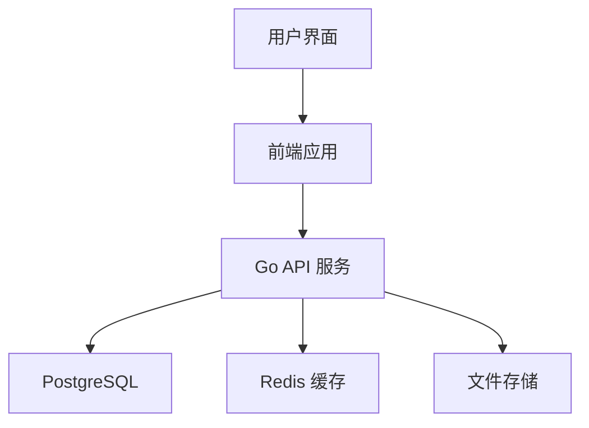

# 博客系统需求文档 (PRD)

## 项目概述
### 项目名称
个人博客系统

### 项目状态
status: approved

### 项目目标
开发一个现代化的个人博客系统，支持文章发布、评论、分类等功能，提供良好的用户体验和响应式设计。

## 问题描述
当前个人博客系统需要解决的问题：
1. 提供一个简单易用的文章发布平台
2. 支持文章分类和标签管理
3. 实现用户评论和互动功能
4. 提供响应式设计，支持多设备访问
5. 确保系统安全性和性能

## 技术架构
### 前端技术栈
- React.js
- Next.js
- Tailwind CSS
- TypeScript

### 后端技术栈
- Go
- Gin Web Framework
- GORM
- PostgreSQL
- JWT 认证
- Redis 缓存

### 系统架构图

## 功能需求
### 1. 用户管理
- 用户注册和登录
- 用户资料管理
- 权限控制
- JWT token 认证

### 2. 文章管理
- 文章创建、编辑、删除
- 文章分类和标签
- 文章搜索
- 文章草稿功能
- Markdown 支持

### 3. 评论系统
- 评论发布
- 评论管理
- 评论回复
- 评论审核

### 4. 系统功能
- 响应式设计
- SEO 优化
- 性能优化（使用 Redis 缓存）
- 数据备份
- 日志系统

## 非功能需求
### 性能需求
- 页面加载时间 < 2秒
- 支持并发用户数 > 1000
- 数据库响应时间 < 100ms
- API 响应时间 < 200ms

### 安全需求
- 用户认证和授权
- 数据加密
- 防 XSS 和 CSRF 攻击
- 定期安全审计
- 请求限流

### 可用性需求
- 系统可用性 > 99.9%
- 支持多语言
- 支持多设备访问
- 优雅降级

## 技术约束
1. 使用现代前端框架
2. 采用 RESTful API 设计
3. 使用 PostgreSQL 数据库
4. 实现响应式设计
5. 支持 SEO 优化
6. 使用 Go 标准库和最佳实践
7. 实现单元测试和集成测试

## 项目风险
1. 技术选型风险
2. 性能优化挑战
3. 安全风险
4. 用户体验设计风险
5. Go 语言并发控制复杂度

## 项目里程碑
1. 需求分析和设计（2周）
2. 前端开发（4周）
3. 后端开发（4周）
4. 测试和优化（2周）
5. 部署上线（1周）

## 验收标准
1. 所有功能需求实现
2. 性能指标达标
3. 安全测试通过
4. 用户体验良好
5. 文档完整
6. 代码覆盖率 > 80%

## 未知因素
1. 具体用户量预测
2. 具体性能瓶颈
3. 具体安全威胁
4. 具体维护成本
5. Go 版本兼容性问题

## 假设条件
1. 用户基础网络条件良好
2. 服务器资源充足
3. 开发团队技术能力达标
4. 项目时间节点合理
5. Go 语言环境稳定