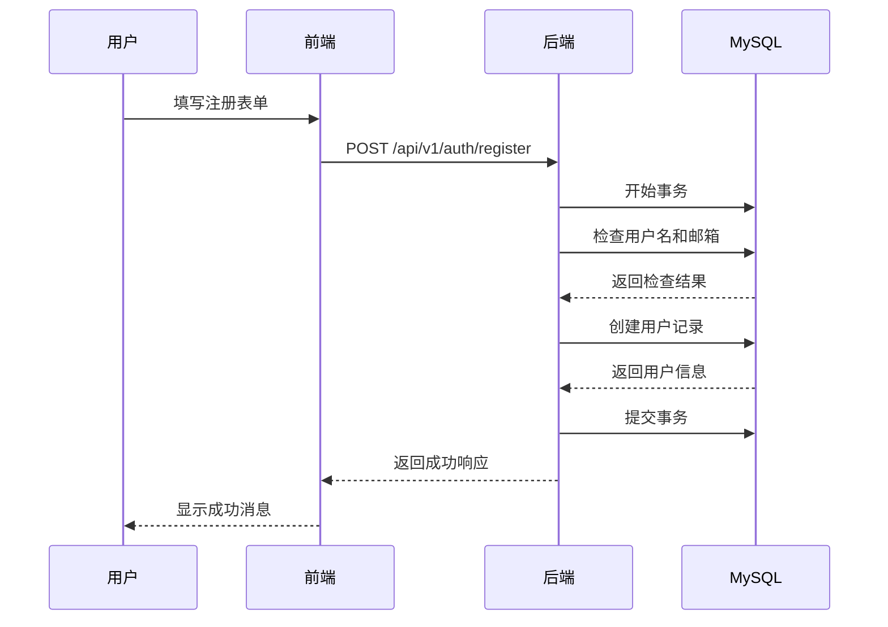
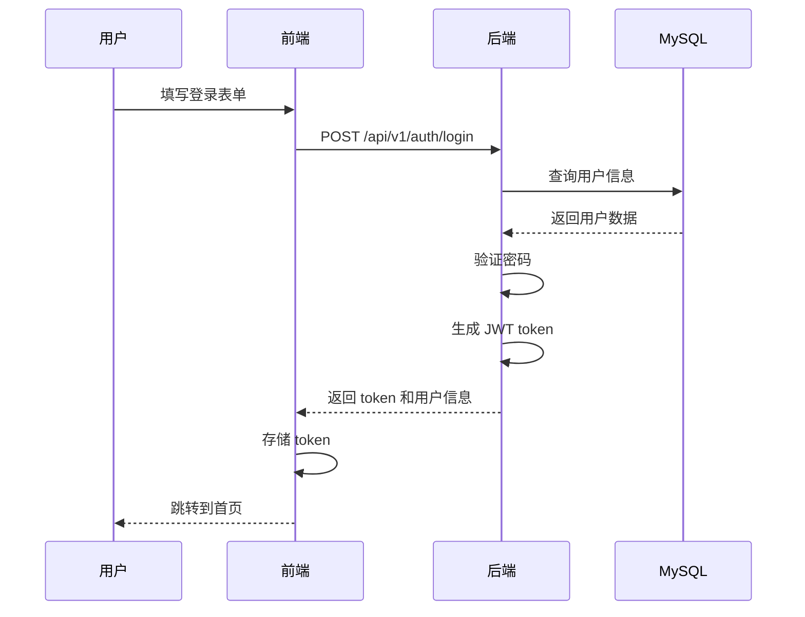

# Story-1
# 实现用户认证功能

**As a** 博客系统用户
**I want** 能够注册和登录系统
**so that** 我可以使用系统的所有功能

## Status

Draft

## Context

这是博客系统的第一个用户故事，实现基础的认证功能。根据架构文档，我们将使用 Go 语言和 Gin 框架实现后端 API，使用 JWT 进行身份认证。前端将使用 Next.js 实现用户界面。数据库采用 MySQL，使用 GORM 作为 ORM 框架。

## Estimation

Story Points: 3

## Tasks

1. - [ ] 后端开发
   1. - [ ] 创建用户模型
   2. - [ ] 实现用户注册 API
   3. - [ ] 实现用户登录 API
   4. - [ ] 实现 JWT 认证中间件
   5. - [ ] 编写单元测试

2. - [ ] 前端开发
   1. - [ ] 创建注册页面
   2. - [ ] 创建登录页面
   3. - [ ] 实现表单验证
   4. - [ ] 实现 API 调用
   5. - [ ] 实现 token 存储

3. - [ ] 数据库开发
   1. - [ ] 创建用户表
   2. - [ ] 实现密码加密
   3. - [ ] 添加必要索引
   4. - [ ] 配置 MySQL 连接池

4. - [ ] 测试
   1. - [ ] 后端 API 测试
   2. - [ ] 前端功能测试
   3. - [ ] 集成测试
   4. - [ ] 性能测试
   5. - [ ] MySQL 性能测试

## Constraints

- 密码必须加密存储
- 使用 JWT 进行身份认证
- 前端表单必须进行验证
- 必须实现错误处理
- 必须记录日志
- 使用 MySQL 事务确保数据一致性
- 实现数据库连接池优化

## Data Models / Schema

### 用户注册请求
```json
{
  "username": "string",
  "email": "string",
  "password": "string"
}
```

### 用户登录请求
```json
{
  "email": "string",
  "password": "string"
}
```

### 登录响应
```json
{
  "token": "string",
  "user": {
    "id": "number",
    "username": "string",
    "email": "string"
  }
}
```

### MySQL 用户表结构
```sql
CREATE TABLE users (
    id BIGINT UNSIGNED AUTO_INCREMENT PRIMARY KEY,
    username VARCHAR(50) NOT NULL UNIQUE,
    email VARCHAR(100) NOT NULL UNIQUE,
    password VARCHAR(100) NOT NULL,
    role VARCHAR(20) DEFAULT 'user',
    created_at TIMESTAMP DEFAULT CURRENT_TIMESTAMP,
    updated_at TIMESTAMP DEFAULT CURRENT_TIMESTAMP ON UPDATE CURRENT_TIMESTAMP,
    INDEX idx_email (email),
    INDEX idx_username (username)
) ENGINE=InnoDB DEFAULT CHARSET=utf8mb4 COLLATE=utf8mb4_unicode_ci;
```

## Structure

```
├── /backend
│   ├── /internal
│   │   ├── /handler
│   │   │   └── auth.go
│   │   ├── /model
│   │   │   └── user.go
│   │   ├── /service
│   │   │   └── auth.go
│   │   └── /middleware
│   │       └── auth.go
│   ├── /config
│   │   └── database.go
├── /frontend
│   ├── /pages
│   │   ├── /auth
│   │   │   ├── register.tsx
│   │   │   └── login.tsx
│   ├── /components
│   │   └── /auth
│   │       ├── RegisterForm.tsx
│   │       └── LoginForm.tsx
```

## Diagrams

### 用户注册流程


### 用户登录流程


## Dev Notes

- 使用 bcrypt 进行密码加密
- 使用 JWT 进行身份认证
- 实现 token 刷新机制
- 添加请求限流
- 实现错误处理中间件
- 配置 MySQL 连接池参数
- 使用事务确保数据一致性
- 添加适当的数据库索引

## Chat Command Log

- 开始实现用户认证功能
- 修改数据库为 MySQL