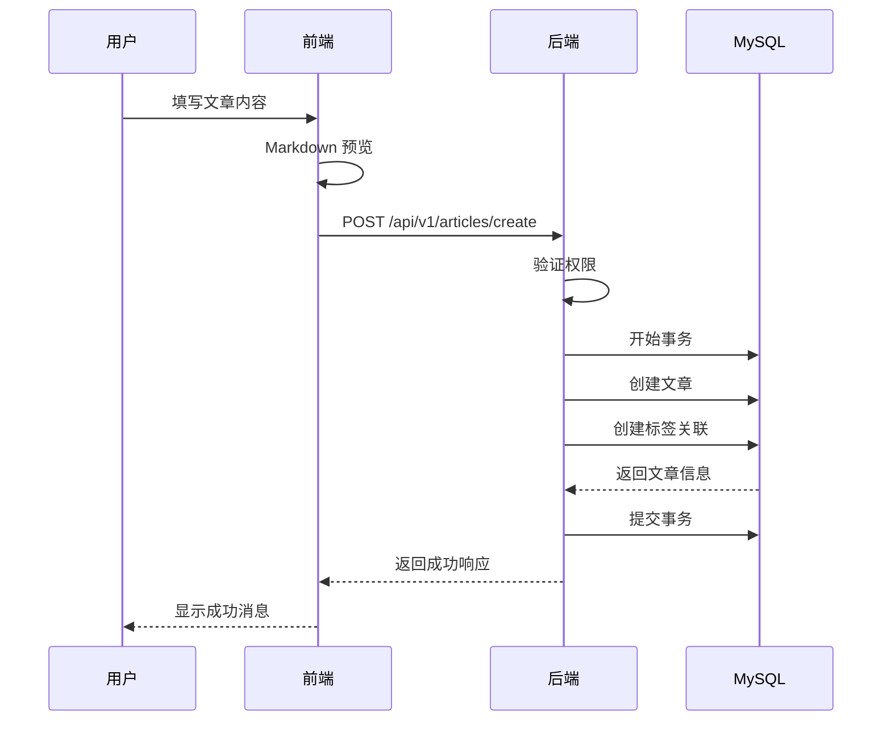
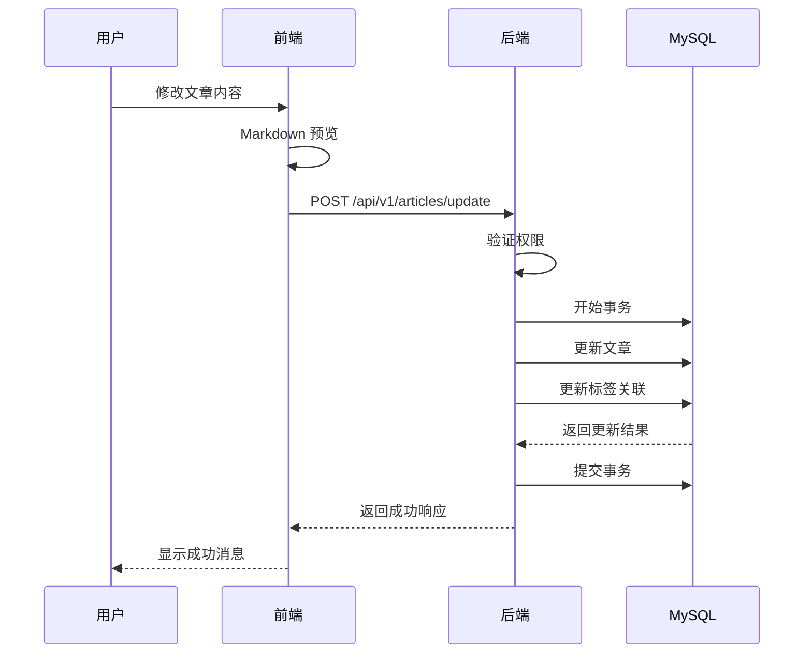

# Story-2
# 实现文章管理功能

**As a** 博客系统用户
**I want** 能够创建、编辑、删除和查看文章
**so that** 我可以管理我的博客内容

## Status

Approved

## Context

这是博客系统的第二个用户故事，实现文章管理的核心功能。根据架构文档，我们将使用 Go 语言和 Gin 框架实现后端 API，前端使用 Next.js 实现用户界面。文章内容将支持 Markdown 格式，并存储在 MySQL 数据库中。

## Security Issues

1. 文章访问权限控制
   - 问题描述：需要确保用户只能编辑和删除自己的文章
   - 风险等级：高
   - 解决方案：
     - 在后端API中添加权限验证中间件
     - 验证当前用户是否为文章作者
     - 实现基于角色的访问控制（RBAC）

2. XSS 攻击防护
   - 问题描述：文章内容可能包含恶意脚本
   - 风险等级：中
   - 解决方案：
     - 对文章内容进行安全过滤
     - 使用安全的 Markdown 解析器
     - 实现内容安全策略（CSP）

## Estimation

Story Points: 5

## Tasks

1. - [ ] 后端开发
   1. - [ ] 创建文章模型
   2. - [ ] 实现文章 CRUD API
   3. - [ ] 实现文章权限控制
   4. - [ ] 添加 Markdown 支持
   5. - [ ] 编写单元测试

2. - [ ] 前端开发
   1. - [ ] 创建文章列表页面
   2. - [ ] 创建文章编辑器页面
   3. - [ ] 实现 Markdown 预览
   4. - [ ] 实现文章状态管理
   5. - [ ] 添加文章操作按钮

3. - [ ] 数据库开发
   1. - [ ] 创建文章表
   2. - [ ] 添加必要索引
   3. - [ ] 实现软删除
   4. - [ ] 优化查询性能

4. - [ ] 测试
   1. - [ ] API 测试
   2. - [ ] 前端组件测试
   3. - [ ] 集成测试
   4. - [ ] 性能测试

## Constraints

- 必须支持 Markdown 格式
- 实现文章的软删除
- 必须进行 XSS 防护
- 必须实现访问控制
- 必须支持文章草稿功能
- 必须实现文章列表分页
- 必须记录文章的创建和更新时间

## Data Models / Schema

### API 接口设计

1. 创建文章
```
POST /api/v1/articles/create
Request Body:
{
  "title": "string",
  "content": "string",
  "status": "draft|published",
  "tags": ["string"]
}
```

2. 更新文章
```
POST /api/v1/articles/update
Request Body:
{
  "id": "number",
  "title": "string",
  "content": "string",
  "status": "draft|published",
  "tags": ["string"]
}
```

3. 删除文章
```
POST /api/v1/articles/delete
Request Body:
{
  "id": "number"
}
```

4. 获取文章详情
```
POST /api/v1/articles/detail
Request Body:
{
  "id": "number"
}
```

5. 获取文章列表
```
POST /api/v1/articles/list
Request Body:
{
  "page": "number",
  "page_size": "number",
  "status": "string",
  "author_id": "number",
  "tag": "string"
}
```

### 响应格式
```json
{
  "code": "number",
  "message": "string",
  "data": {
    // 文章详情
    "id": "number",
    "title": "string",
    "content": "string",
    "status": "string",
    "author": {
      "id": "number",
      "username": "string"
    },
    "tags": ["string"],
    "created_at": "datetime",
    "updated_at": "datetime"
  }
}
```

### MySQL 文章表结构
```sql
CREATE TABLE articles (
    id BIGINT UNSIGNED AUTO_INCREMENT PRIMARY KEY,
    title VARCHAR(200) NOT NULL,
    content TEXT NOT NULL,
    status VARCHAR(20) DEFAULT 'draft',
    author_id BIGINT UNSIGNED NOT NULL,
    deleted_at TIMESTAMP NULL,
    created_at TIMESTAMP DEFAULT CURRENT_TIMESTAMP,
    updated_at TIMESTAMP DEFAULT CURRENT_TIMESTAMP ON UPDATE CURRENT_TIMESTAMP,
    FOREIGN KEY (author_id) REFERENCES users(id),
    INDEX idx_author_id (author_id),
    INDEX idx_status (status),
    INDEX idx_created_at (created_at)
) ENGINE=InnoDB DEFAULT CHARSET=utf8mb4 COLLATE=utf8mb4_unicode_ci;

CREATE TABLE tags (
    id BIGINT UNSIGNED AUTO_INCREMENT PRIMARY KEY,
    name VARCHAR(50) NOT NULL UNIQUE,
    created_at TIMESTAMP DEFAULT CURRENT_TIMESTAMP,
    INDEX idx_name (name)
) ENGINE=InnoDB DEFAULT CHARSET=utf8mb4 COLLATE=utf8mb4_unicode_ci;

CREATE TABLE article_tags (
    article_id BIGINT UNSIGNED NOT NULL,
    tag_id BIGINT UNSIGNED NOT NULL,
    PRIMARY KEY (article_id, tag_id),
    FOREIGN KEY (article_id) REFERENCES articles(id),
    FOREIGN KEY (tag_id) REFERENCES tags(id)
) ENGINE=InnoDB DEFAULT CHARSET=utf8mb4 COLLATE=utf8mb4_unicode_ci;
```

## Structure

```
├── /backend
│   ├── /internal
│   │   ├── /handler
│   │   │   └── article.go
│   │   │   └── article_test.go
│   │   ├── /model
│   │   │   ├── article.go
│   │   │   └── tag.go
│   │   ├── /service
│   │   │   └── article.go
│   │   │   └── article_test.go
│   │   └── /middleware
│   │       └── auth.go
├── /frontend
│   ├── /pages
│   │   ├── /articles
│   │   │   ├── index.tsx
│   │   │   ├── [id].tsx
│   │   │   ├── new.tsx
│   │   │   └── edit/[id].tsx
│   ├── /components
│   │   └── /article
│   │       ├── Editor.tsx
│   │       ├── Preview.tsx
│   │       └── List.tsx
```

## Diagrams

### 文章创建流程


### 文章更新流程


## Dev Notes

- 使用 markdown-it 进行 Markdown 解析
- 实现文章内容的 XSS 过滤
- 添加文章访问权限控制
- 实现文章软删除功能
- 优化文章列表查询性能
- 实现文章缓存机制
- 添加文章访问统计
- 实现标签管理功能

## Chat Command Log

- 开始实现文章管理功能